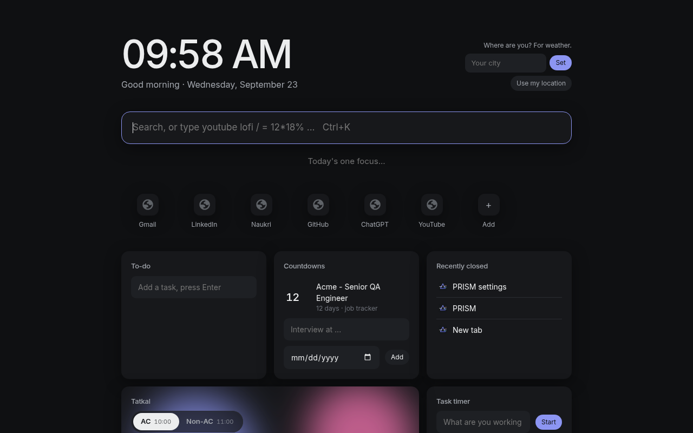
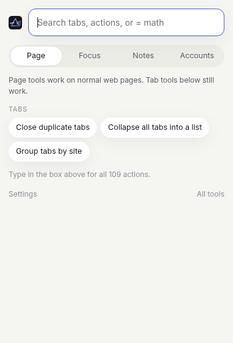
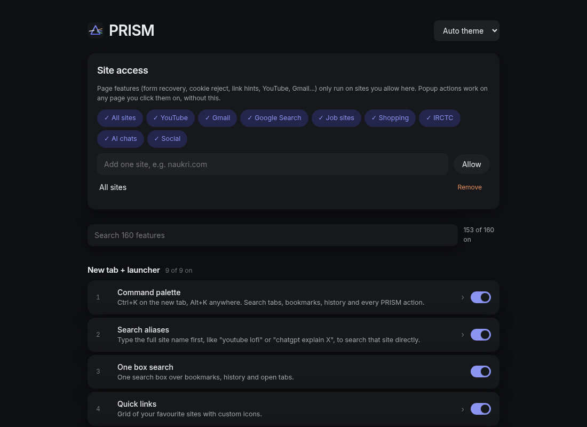
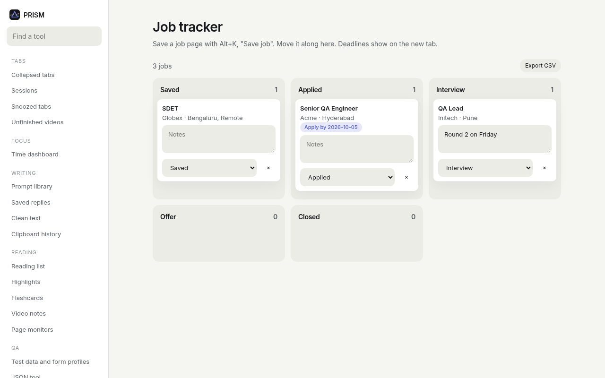
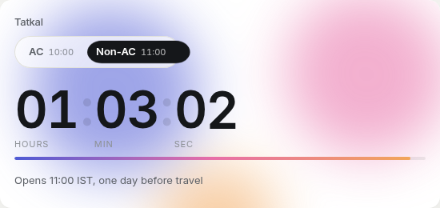
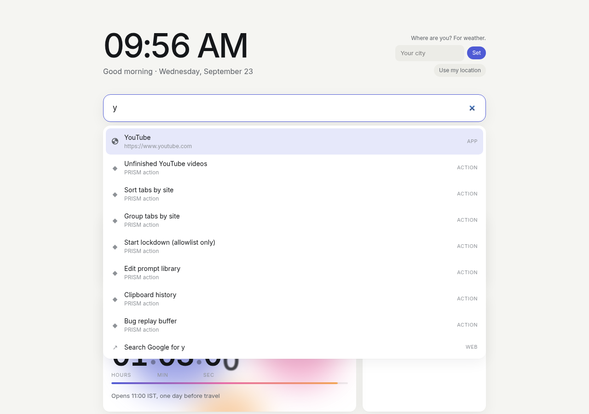

# PRISM

160 small browser tools in one quiet Chrome extension. New tab, command palette, tab tools, a real site blocker, job-hunt helpers, a QA kit, PDF and image tools, a screen recorder and more.

Everything stays on your computer. No account, no server, no tracking, no paid API.

| Popup (Alt+K) | Settings | Job tracker |
|---|---|---|
|  |  |  |
|  |  | |

Full list: [docs/FEATURES.md](docs/FEATURES.md).

## What is inside

- **New tab**: clock, one-line focus, search box that also does math (`= 12*18%`, `2.5 lakh in million`) and searches a site when you type its full name first (`youtube lofi`, `chatgpt explain X`, `claude`, `gemini`, `google`), quick links (they show first when your search matches them), to-do, weather (asks for your city, or uses your location only when you click "Use my location"), countdowns, recently closed tabs, a live Tatkal countdown, task timer, flashcards.
- **Command palette**: press `Alt+K` anywhere. Search open tabs, bookmarks, history and about 110 actions.
- **Tabs**: collapse all tabs into a list, named sessions, close duplicates, snooze a tab, sort and group by site, auto-sleep idle tabs.
- **Focus**: a blocker that stops the page before it loads, schedules, daily time allowance, lockdown mode, Pomodoro on the toolbar icon, "why are you here?" prompt, time dashboard, feed hider, scroll stopper, grayscale sites.
- **AI without keys**: uses Chrome's on-device AI (Gemini Nano, Translator) when your Chrome has it. When it does not, PRISM opens ChatGPT, Claude or Gemini in a new tab with your text already filled in. You pick the chat in Settings.
- **Reading**: reader mode, page to Markdown, tables to CSV, reading list with an offline copy, highlights that come back when you revisit, recipe mode, real publish date, read aloud.
- **QA / dev kit**: bug report with console errors, Playwright locator picker, fake-data form filler, right-click test strings, JSON viewer, cookie and localStorage editor, ruler, colour picker, broken-link check, accessibility and speed checks.
- **Job hunt**: save a job in one click, pipeline board with CSV export, keyword highlighter, application autofill from your profile, filter promoted/applied jobs on LinkedIn, Naukri and Indeed, job age and applicant count on LinkedIn.
- **Files and capture**: full-page screenshot with arrows/boxes/blur, PDF merge/pick pages/rotate, fill and sign a PDF, images to PDF, compress an image under 200 KB, screen recorder with mic and webcam bubble (download as MP4), "save the last 30 seconds" replay buffer, video to GIF. All done in the browser; nothing is uploaded.
- **India daily life**: lakh/crore ↔ million on any number you select, PAN/Aadhaar/phone masking before screenshots, IRCTC passenger fill (you still solve the captcha and press every button).
- **Gmail**: saved-reply templates, read-tracker blocking, unsubscribe chip, "you forgot the attachment" check.
- **Trust and safety**: warning on lookalike, punycode and shortened links; a note on the first visit to a new site.

## Install (5 minutes, no coding)

PRISM is not on the Chrome Web Store. You load it yourself. This is safe and normal for your own extensions.

1. **Download the code.** On this page click the green **Code** button, then **Download ZIP**. Unzip it. You get a folder called `prism-main`.
   Keep this folder where it is. Chrome runs PRISM from it; if you delete it, PRISM stops.
2. **Open the extensions page.** In Chrome, type `chrome://extensions` in the address bar and press Enter.
3. **Turn on Developer mode.** Switch at the top right.
4. **Load PRISM.** Click **Load unpacked** and choose the `prism-main` folder (the one that has `manifest.json` inside).
5. **Pin it.** Click the puzzle icon in the toolbar, then the pin next to PRISM.
6. Chrome asks whether to keep the new tab page. Click **Keep it** to use PRISM's new tab. (If you do not want it, turn off the "New tab" features in Settings and choose **Change it back**.)

The Settings page opens by itself the first time.

## Your first 2 minutes

1. **Choose where page features may run.** In Settings > **Site access**, click a pack like **Job sites** or **YouTube**, or **All sites**. Chrome asks you to confirm. Until you do this, PRISM does not touch any website.
2. Open any page and press **Alt+K**. Type `dup` and press Enter to close duplicate tabs. Type `screen` for a full-page screenshot.
3. Open a new tab and type `= 18% of 1250000` in the box.
4. Select a number like `12,50,000` on a page (with that site allowed) to see it in lakh and million.

Turn anything off in Settings. Every feature has its own switch and its own settings, and there is a search box.

## Permissions, in plain words

| Permission | Why |
|---|---|
| Site access (optional, you choose) | Page features only run on sites you allow in Settings. Nothing is granted at install. |
| activeTab, scripting | Popup and Alt+K actions work on the tab you are on, only when you click them. |
| tabs, tabGroups, sessions, history, bookmarks | Tab tools, palette search, recently closed, new-site check. |
| declarativeNetRequest, webNavigation | The site blocker, redirects, clean links. |
| storage, unlimitedStorage | Your data, in this browser only. |
| downloads, cookies, browsingData, contentSettings | Downloads panel and rename, cookie tools and login switcher, "clear this site", auto-deny notification prompts. |
| alarms, idle, notifications, tts, contextMenus, management, favicon | Timers, time tracking, alerts, read aloud, right-click menus, extension audit, site icons. |
| geolocation | Only used if you click "Use my location" for weather. PRISM never looks up your location on its own. |

## Your data

Everything is in `chrome.storage.local` in this browser. Settings > **Backup** exports it to a JSON file and imports it on another PC.

The export includes things like clipboard history and any saved login cookies (Login switcher). Treat the file like a password. Do not share it or commit it anywhere.

## Honest limits

- **Screen recorder format**: Chrome records MP4 (H.264) directly, so there is no conversion step and nothing is uploaded. On an older Chrome that cannot record MP4, you get a WebM file instead and the page tells you so. Checked in Chrome 151: an MP4 file is produced from a test stream. A real screen + mic recording has not been tried yet.

- **Tested so far**: automated checks in headless Chrome on a local test page. The extension loads; all 46 background features start with no errors; 74 page features load on a web page with no errors; 47 page actions run (2 are pickers that wait for your click, and translation needs Chrome's on-device model, which the test browser does not have); all 31 Tools sections open; new tab, popup and Settings open with no errors.
- **Not tested yet on real sites**: Gmail, LinkedIn, Naukri, Indeed, IRCTC, YouTube, Amazon, Flipkart, Myntra, X, Reddit, and the ChatGPT/Claude/Gemini auto-fill. These features read the site's page layout, and sites change their layout often. Expect some to need fixes.
- **Not tested yet at all**: on-device AI (Summarizer, Rewriter, Proofreader, Translator), screen recorder, replay buffer, webcam bubble, video to GIF, PDF tools and signing with real PDFs, image compression, downloads rename/sort rules, blocker schedules and alarms over real time, keyboard shortcuts, right-click menus, desktop notifications, the login switcher, and the price and page monitors over several hours.
- Price watch and page monitor only check while Chrome is open.
- The blocker is a speed bump, not a lock. Anyone can turn PRISM off in `chrome://extensions`.
- On-device AI needs a recent desktop Chrome and a supported computer. When it is missing PRISM falls back to the web chat.
- The Login switcher swaps cookie sets. It is not a true container like Firefox has; some sites also keep you logged in with other storage.
- IRCTC fill only types passenger details. It never solves captchas or presses Book.

## Common problems

- **"Nothing happens on a website."** Allow that site in Settings > Site access, then reload the page.
- **"Alt+K does nothing."** Another app may use it. Change it at `chrome://extensions/shortcuts`.
- **"Manifest file is missing or unreadable"** when loading: you picked the wrong folder. Choose the folder that has `manifest.json` directly inside.
- **"Summarize opens ChatGPT instead of working in place."** Your Chrome has no on-device model. That is the fallback working as designed.
- **Error badge on the extensions page**: click **Errors**, copy the text, and open an issue.
- **After updating the code**: go to `chrome://extensions` and press the reload arrow on PRISM.

## For developers

Plain JavaScript, HTML and CSS. No build step. See [AGENTS.md](AGENTS.md) for the layout and conventions.

## License

MIT, see [LICENSE](LICENSE). Bundled libraries and fonts: [THIRD_PARTY_NOTICES.md](THIRD_PARTY_NOTICES.md).
